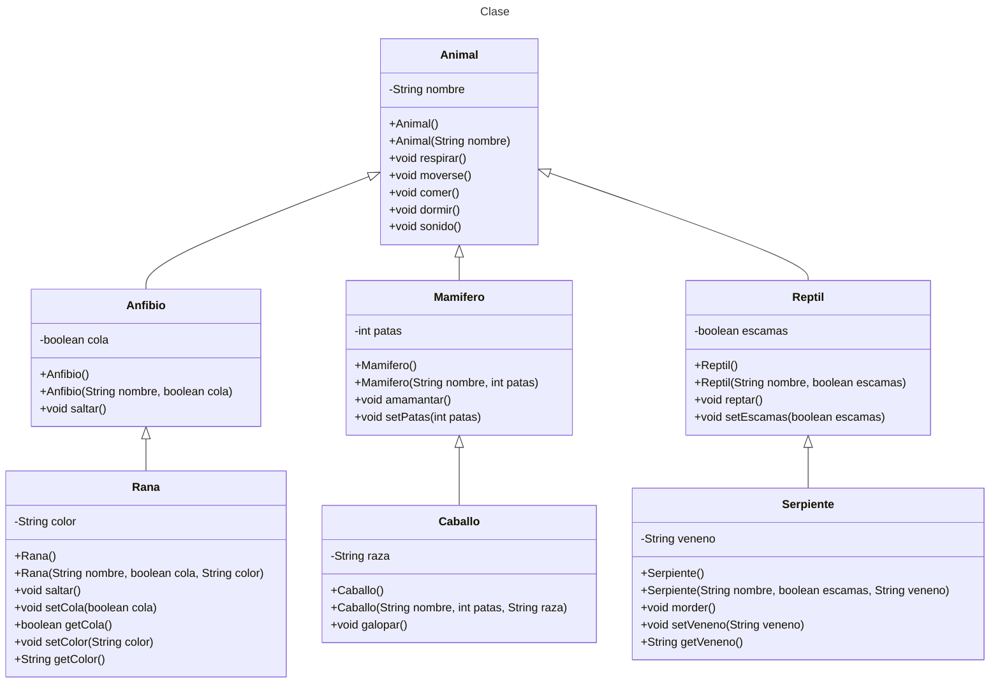

# Proyecto - Herencia

## Objetivo

El objetivo de este proyecto es demostrar el uso de la herencia en la programación orientada a objetos mediante la creación de un conjunto de clases que representan diferentes tipos de animales. A través de este ejercicio, se busca:

1. **Comprender y aplicar el concepto de herencia**: Crear una jerarquía de clases donde las clases derivadas heredan atributos y métodos de sus clases base.
2. **Promover la reutilización de código**: Utilizar la herencia para evitar la duplicación de código y facilitar la extensión de funcionalidades.
3. **Implementar y verificar el comportamiento específico de cada clase**: Definir métodos y atributos específicos para cada tipo de animal y verificar su correcto funcionamiento mediante pruebas unitarias.
4. **Visualizar las relaciones entre clases**: Utilizar diagramas de clases para representar gráficamente la estructura y las relaciones de herencia entre las clases.

## Descripción del Proyecto

1. **Paquete `animales`**: Contiene todas las clases relacionadas con los animales.
2. **Clase `Animal`**: Clase base que define atributos y métodos comunes a todos los animales.
3. **Clases derivadas**: 
    - `Mamifero`: Hereda de `Animal` y añade atributos y métodos específicos de los mamíferos.
    - `Anfibio`: Hereda de `Animal` y añade atributos y métodos específicos de los anfibios.
    - `Reptil`: Hereda de `Animal` y añade atributos y métodos específicos de los reptiles.
4. **Clases específicas**:
    - `Caballo`: Hereda de `Mamifero` y añade atributos y métodos específicos de los caballos.
    - `Rana`: Hereda de `Anfibio` y añade atributos y métodos específicos de las ranas.
    - `Serpiente`: Hereda de `Reptil` y añade atributos y métodos específicos de las serpientes.
5. **Pruebas unitarias**: Verifican que las clases derivadas heredan correctamente de sus clases base y que los atributos y métodos específicos funcionan como se espera.
6. **Diagrama de clases**: Representa gráficamente la jerarquía y las relaciones de herencia entre las clases.


## Diagrama de clases
[Editor en línea](https://mermaid.live/)

[Referencia-Mermaid](https://mermaid.js.org/syntax/classDiagram.html)

## Diagrama de clases UML con draw.io
El repositorio está configurado para crear Diagramas de clases UML con ```draw.io```. Para usarlo simplemente agrega un archivo con extensión ```.drawio.png```, das doble clic sobre el mismo y se activará el editor ```draw.io``` incrustado en ```VSCode``` para edición. Asegúrate de agregar las formas UML en el menú de formas del lado izquierdo (opción ```+Más formas```).

## Uso del proyecto con make

### Default - Compilar+Probar+Ejecutar
```
make
```
### Compilar
```
make compile
```
### Probar todo
```
make test
```
### Ejecutar App
```
make run
```
### Limpiar binarios
```
make clean
```
## Comandos Git-Cambios y envío a Autograding

### Por cada cambio importante que haga, actualice su historia usando los comandos:
```
git add .
git commit -m "Descripción del cambio"
```
### Envíe sus actualizaciones a GitHub para Autograding con el comando:
```
git push origin main
```
## Comandos individuales
### Compilar

```
find ./ -type f -name "*.java" > compfiles.txt
javac -d build -cp lib/junit-platform-console-standalone-1.5.2.jar @compfiles.txt
```
Ejecutar ambos comandos en 1 sólo paso:

```
find ./ -type f -name "*.java" > compfiles.txt ; javac -d build -cp lib/junit-platform-console-standalone-1.5.2.jar @compfiles.txt
```


### Ejecutar Todas la pruebas locales de 1 Test Case

```
java -jar lib/junit-platform-console-standalone-1.5.2.jar -class-path build --select-class miTest.AppTest
```
### Ejecutar 1 prueba local de 1 Test Case

```
java -jar lib/junit-platform-console-standalone-1.5.2.jar -class-path build --select-method miTest.AppTest#appHasAGreeting
```
### Ejecutar App
```
java -cp build miPrincipal.Principal
```
Los comandos anteriores están considerados para un ambiente Linux. [Referencia.](https://www.baeldung.com/junit-run-from-command-line)
